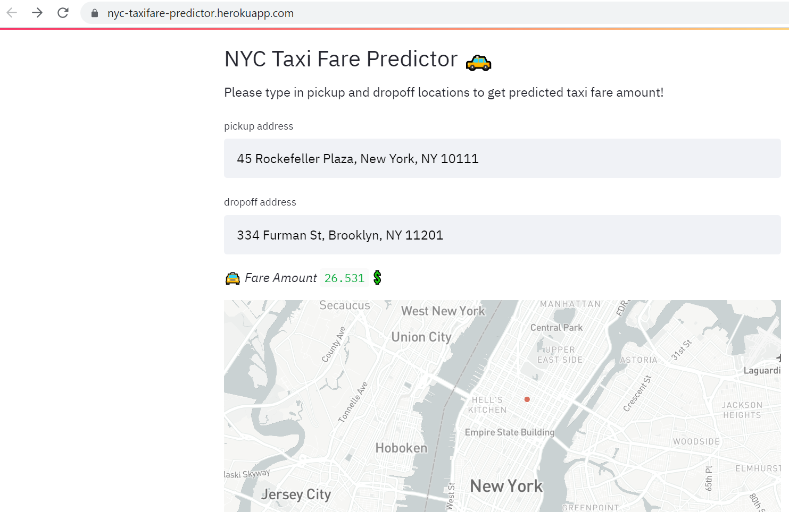

[This is a kaggle competition project](https://www.kaggle.com/c/new-york-city-taxi-fare-prediction)

This project is about predicting taxi fare amount for a given trip in New York City.
It includes data exploration (Geospatial analysis), featureengineering (includes transforming cyclical features),
fine tuning XGBoost model, creating an API, and continuious deployment on Heroku.

the :oncoming_taxi: NYC Taxi Fare Predictor API :point_right: https://github.com/Guli-Y/NYCtaxifarePredictorAPI

:point_right: https://nyc-taxifare-predictor.herokuapp.com/   :hourglass_flowing_sand: first load will take ~1 minutes

Note that this project is only for practicing and the model was trained on older datasets. Therefore the predicted fare can't be trusted. 
